# TP6 - Monopoly

This project is a terminal based implementation of the classic Monopoly board game. It involves creating a game engine that manages the game's dynamics, including player interactions, board state, and game logic. The core of the project is built around a structured architecture that includes key classes like Gamecore, BoardManager, and PlayerManager, each handling specific aspects of the game.

## Software Architecture

The project classes are organized as follows (the diagram can be visualized on the Mermaid [website](https://mermaid.live):

```mermaid
%%{init: {'theme': 'neutral' } }%%
classDiagram
    class BoardManager {
        +BoardManager(std::vector< std::shared_ptr< Space>> _board, std::vector< std::unique_ptr< CommunityChestCard>> _communityChestDeck, std::vector< std::unique_ptr< ChanceCard>> _chanceDeck)
        +~BoardManager()
        -dice1 : Dice
        -dice2 : Dice
        -chanceGOJFCTaken : bool
        -communityChestGOJFCTaken : bool
        -properties : std::map< Color, std::vector< std::shared_ptr< Property>>>
        +getCurrentDicesValue() : std::pair< int , int>
        -currentDicesValue : std::pair< int, int>
        +getPlayerManager() : std::shared_ptr< PlayerManager>
        -playerManager : std::shared_ptr< PlayerManager>
        +getOwnedGroups(std::shared_ptr< Player> player) : std::vector< std::shared_ptr< Property>>
        -board : std::vector< std::shared_ptr< Space>>
        +getBoard() : std::vector< std::shared_ptr< Space>>
        -chanceDeck : std::vector< std::unique_ptr< ChanceCard>>
        -communityChestDeck : std::vector< std::unique_ptr< CommunityChestCard>>
        +affectOwnership(std::shared_ptr< Player> player, std::shared_ptr< Space> space) : void
        +buildOnProperties(std::vector< std::shared_ptr< Property>> properties, std::shared_ptr< Player> player, int attempts) : void
        +drawChanceCard() : void
        +drawCommunityChestCard() : void
        +handleSpace() : void
        +movePlayer(int diceValue) : void
        +rollDice() : void
        +setChanceGOJFCTaken(bool taken) : void
        +setCommunityChestGOJFCTaken(bool taken) : void
    }

    class BuyableSpace {
    	<<abstract>>
        +BuyableSpace(std::string _name, int _price, std::vector< int> _rent)
        +~BuyableSpace()
        +getPrice() : int const
        -price : int
        +getOwner() : std::shared_ptr< Player> const
        -owner : std::shared_ptr< Player>
        +getRent() : std::vector< int> const
        -rent : std::vector< int>
        +action(std::shared_ptr< BoardManager> board) : void *
        +auction(std::shared_ptr< BoardManager> board) : void *
        +setOwner(std::shared_ptr< Player> _owner) : void
    }

    class Card {
    	<<abstract>>
        +Card(std::string _description)
        #function< void(std::shared_ptr< BoardManager>)
        +~Card()
        -description : std::string
        +getDescription() : std::string const
        +action(std::shared_ptr< BoardManager> board) : void *
    }

    class Chance {
        +Chance()
        +~Chance()
        +operator<<(std::ostream& os, const Chance& chance) : std :: ostream&
        -name : std::string
        +action(std::shared_ptr< BoardManager> board) : void
    }

    class ChanceCard {
        +ChanceCard(std::string _description, std::function< void ( std::shared_ptr< BoardManager>)> _actionFunction)
        +~ChanceCard()
        +operator<<(std::ostream& os, const ChanceCard& card) : std :: ostream&
        +action(std::shared_ptr< BoardManager> board) : void
    }

    class CommunityChest {
        +CommunityChest()
        +~CommunityChest()
        +operator<<(std::ostream& os, const CommunityChest& communityChest) : std :: ostream&
        -name : std::string
        +action(std::shared_ptr< BoardManager> board) : void
    }

    class CommunityChestCard {
        +CommunityChestCard(std::string _description, std::function< void ( std::shared_ptr< BoardManager>)> _actionFunction)
        +~CommunityChestCard()
        +operator<<(std::ostream& os, const CommunityChestCard& card) : std :: ostream&
        +action(std::shared_ptr< BoardManager> board) : void
    }

    class Dice {
        +Dice()
        +~Dice()
        +roll() : int
        -value : int
        -generator : std::default_random_engine
        -distribution : std::uniform_int_distribution< int>
    }

    class FreeParking {
        +FreeParking()
        +~FreeParking()
        +operator<<(std::ostream& os, const FreeParking& freeParking) : std :: ostream&
        -name : std::string
        +action(std::shared_ptr< BoardManager> board) : void
    }

    class GameCore {
        +GameCore(std::vector< std::shared_ptr< Space>> spaces, std::vector< std::unique_ptr< CommunityChestCard>> communityChestCards, std::vector< std::unique_ptr< ChanceCard>> chanceCards)
        +~GameCore()
        -consecutiveDoubles : int
        -boardManager : std::shared_ptr< BoardManager>
        +playTurn() : void
        +startGame() : void
    }

    class Go {
        +Go()
        +~Go()
        +operator<<(std::ostream& os, const Go& go) : std :: ostream&
        -name : std::string
        +action(std::shared_ptr< BoardManager> board) : void
    }

    class GoToJail {
        +GoToJail()
        +~GoToJail()
        +operator<<(std::ostream& os, const GoToJail& goToJail) : std :: ostream&
        -name : std::string
        +action(std::shared_ptr< BoardManager> board) : void
    }

    class Jail {
        +Jail()
        +~Jail()
        +operator<<(std::ostream& os, const Jail& jail) : std :: ostream&
        -name : std::string
        +action(std::shared_ptr< BoardManager> board) : void
    }

    class Player {
        +Player(std::string _name)
        +~Player()
        +getHasChanceGOJFC() : bool const
        +getHasCommunityChestGOJFC() : bool const
        -hasChanceGOJFC : bool
        -hasCommunityChestGOJFC : bool
        +getMoney() : int const
        +getNbStationsOwned() : int const
        +getNbUtilitiesOwned() : int const
        +getPosition() : int const
        +getRemainingTurnsInJail() : int const
        -money : int
        -nbStationsOwned : int
        -nbUtilitiesOwned : int
        -position : int
        -remainingTurnsInJail : int
        +getName() : std::string const
        -name : std::string
        +setHasChanceGOJFC(bool _hasChanceGOJFC) : void
        +setHasCommunityChestGOJFC(bool _hasCommunityChestGOJFC) : void
        +setMoney(int _money) : void
        +setNbStationsOwned(int _nbStationsOwned) : void
        +setNbUtilitiesOwned(int _nbUtilitiesOwned) : void
        +setPosition(int _position) : void
        +setRemainingTurnsInJail(int _remainingTurnsInJail) : void
    }

    class PlayerManager {
        +PlayerManager()
        +~PlayerManager()
        +getNbPlayers() : int
        -currentPlayer : std::shared_ptr< Player>
        +getCurrentPlayer() : std::shared_ptr< Player>
        +getPlayer(int index) : std::shared_ptr< Player>
        -players : std::vector< std::shared_ptr< Player>>
        +addPlayer(std::shared_ptr< Player> player) : void
        +removePlayer(std::shared_ptr< Player> player) : void
        +setCurrentPlayer(std::shared_ptr< Player> player) : void
        +setNextPlayer() : void
        +transferMoneyFromTo(std::shared_ptr< Player> player1, std::shared_ptr< Player> player2, int amount) : void
    }

    class Property {
        +Property(std::string _name, Color _color, int _price, int _housePrice, std::vector< int> _rent)
        +~Property()
        -color : Color
        -nbBuildings : PropertyRent
        +getColor() : int const
        +getHousePrice() : int const
        +getNbBuildings() : int const
        -housePrice : int
        +operator<<(std::ostream& os, const Property& property) : std :: ostream&
        +getColorString() : std::string const
        +action(std::shared_ptr< BoardManager> board) : void
        +auction(std::shared_ptr< BoardManager> board) : void
        +setNbBuildings(PropertyRent _nbBuildings) : void
    }

    class Space {
        <<abstract>>
        +Space(std::string _name)
        +~Space()
        +getName() : std::string const
        -name : std::string
        +action(std::shared_ptr< BoardManager> board) : void *
    }

    class Station {
        +Station(std::string _name)
        +~Station()
        -price : int
        +operator<<(std::ostream& os, const Station& station) : std :: ostream&
        +action(std::shared_ptr< BoardManager> board) : void
        +auction(std::shared_ptr< BoardManager> board) : void
    }

    class Tax {
        +Tax(std::string _name, int _amount)
        +~Tax()
        -amount : int
        +getAmount() : int const
        +operator<<(std::ostream& os, const Tax& tax) : std :: ostream&
        -name : std::string
        +action(std::shared_ptr< BoardManager> board) : void
    }

    class Utility {
        +Utility(std::string _name)
        +~Utility()
        -price : int
        +operator<<(std::ostream& os, const Utility& utility) : std :: ostream&
        +action(std::shared_ptr< BoardManager> board) : void
        +auction(std::shared_ptr< BoardManager> board) : void
    }

    class Color {
        <<enum>>
        BLUE
        GREEN
        LIGHT_BLUE
        ORANGE
        PINK
        PURPLE
        RED
        YELLOW
    }

    class PropertyRent {
        <<enum>>
        BASE_RENT
        FOUR_HOUSES
        FULL_GROUP
        HOTEL
        ONE_HOUSE
        THREE_HOUSES
        TWO_HOUSES
    }

    BuyableSpace <|-- Property
    BuyableSpace <|-- Station
    BuyableSpace <|-- Utility
    Card <|-- ChanceCard
    Card <|-- CommunityChestCard
    Space <|-- BuyableSpace
    Space <|-- Chance
    Space <|-- CommunityChest
    Space <|-- FreeParking
    Space <|-- Go
    Space <|-- GoToJail
    Space <|-- Jail
    Space <|-- Tax
    BoardManager *-- ChanceCard
    BoardManager -- Color
    BoardManager *-- CommunityChestCard
    BoardManager "2" o-- Dice
    BoardManager "1" o-- PlayerManager
    BoardManager -- Property
    BoardManager "0..*" *-- Space
    BuyableSpace "1" o-- Player
    GameCore "1" o-- BoardManager
    PlayerManager "2..8" o-- Player
    Property *-- Color
    Property *-- PropertyRent

```

The main class, `Gamecore`, manages the game's dynamics, including game creation, gameplay flow, and dice rolls. This class primarily interacts with two other classes:

- `BoardManager` handles all activities on the board during the game, such as movement, board spaces, cards, and overall board state.
- `PlayerManager` manages all players, including adding, removing, and switching players, as well as handling money transfers between players or with the bank.

These classes interact with other classes in the project:

- `Player` represents a player instance, containing attributes like position, money, name, and prison-related information.
- `Card` is a parent class defining a card with a description and a function executed when drawn. This class has two derived classes:
    - `CommunityChestCard` is drawn when a player lands on a “Community Chest” space. The description is displayed, and the corresponding action is executed.
    - `ChanceCard` is similar but is drawn when a player lands on a “Chance” space.
- `Space` is an abstract parent class representing each space on the board. It requires every space to have a name and an action to execute when a player lands on it.
    - `BuyableSpace` is an abstract class derived from `Space`, distinguishing buyable spaces from others on the board. It includes rent and owner attributes (with accessors) and a bidding method for unowned spaces. Derived classes include:
        - `Property` represents a property a player can buy and build on (if they own all properties of the same color, using the `Color` enum class). If another player owns the property, rent is paid based on the number of buildings (using the `PropertyRent` enum class). If no one owns it and the player does not want to buy it, it goes to auction.
        - `Station` represents a train station on the board. Similar to a property, it can be bought or auctioned, with rent depending on the number of stations owned by the player.
        - `Utility` represents utilities like the “Electric Company” and “Water Works”. Rent is calculated based on the sum of two dice, multiplied by 4 if the player owns one utility and by 10 if they own both.
    - `Tax` represents two spaces where the player pays a certain amount to the bank.
    - `Jail` represents the prison, handling different scenarios like checking if the player should be in prison, offering the option to use a "Get Out of Jail Free" card, pay 50 euros, or roll the dice for a double.
    - `GoToJail` sends the player to jail without passing "Go".
    - `FreeParking` has no effect on the game.
    - `Go` represents the starting space, giving a player 200 euros (or 400 euros if landed directly on).
    - `CommunityChest` draws a random `CommunityChestCard` and executes its action.
    - `Chance` draws a random `ChanceCard` and executes its action.

## Software Tools

### Memory Management

Given the project's complexity, STL `smart pointers` are used to prevent memory leaks and enhance code readability. Two types of pointers are used:

- `unique_ptr` owns an object exclusively (using `make_unique`). Only one `unique_ptr` can point to an object, and the object is automatically freed when the `unique_ptr` is destroyed or reassigned.
- `shared_ptr` allows multiple pointers to share ownership of an object (using `make_shared`). A reference counter tracks the number of pointers sharing the object, which is freed when the last `shared_ptr` is destroyed.

`unique_ptr` is used for objects with a single owner (like `CommunityChestCard` and `ChanceCard` accessed only by `BoardManager`), and `shared_ptr` is used when multiple parts of the code need access to an object (like `Player`).

### User Input Management

This project requires user inputs, such as pressing enter, entering numbers, or strings. Functions in `iomanager.h` handle these inputs, simplifying input management and aiding in testing.

### Output Management

The game runs solely through the terminal, necessitating extensive text output. The output varies between development and user phases, hence the use of the `spdlog` logger. It allows different log levels (info, debug, error, etc.) and can write to files, useful during testing.

### Unit Testing

Unit tests using `GoogleTest` ensure code functionality throughout development. Tests include board construction, cards, and dice randomness.

Additionally, an automated full game simulation was implemented using a second set of functions in `iomanager.h` that randomly return values, used only during test execution (via preprocessor directives).

### CMakeLists

External libraries (GoogleTest and spdlog) are necessary for this project. To maintain portability, these libraries are automatically downloaded during the initial project setup using a CMakeLists file and the `FetchContent` module to fetch GitHub repositories.

Preprocessor directives define different project versions:

- Release: User version (no debug logging, only info, warn, and error)
- Debug: Development version (debug logs displayed)
- Tests: Testing version (logs to a file, using automatic input to replace user input)
